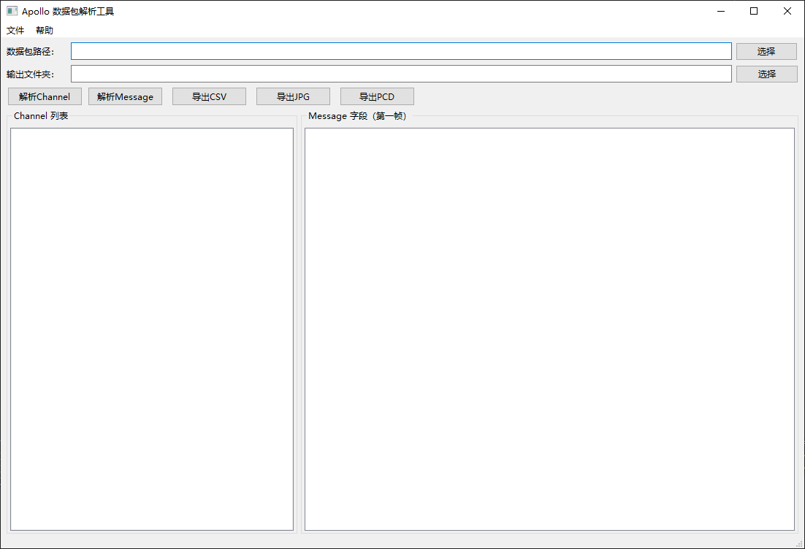

## ApolloPacketParser

一个基于 **Python + PySide6** 开发的 Apollo Record 数据包图形化解析工具。

该工具提供简单的 GUI 界面，可以读取 Apollo Record 数据包、查看其中的 Channel、解析 Message 字段，并将数据导出为 **CSV、JPG 或 PCD** 文件。

## 🚀 Quick Start

### 1. 前置条件

python 3.10+

### 2. 安装依赖

```
pip install "numpy==2.2.6"
pip install cyber_record record_msg PySide6
```

### 3. 启动程序

进入项目根目录后运行：

```
python main.py
```

程序启动后会打开 **Apollo 数据包解析工具** 主界面。

## 📖 使用方法

1. 点击 **“选择”**，打开 Apollo Record 数据包。

2. 选择文件的 **输出目录**。

3. 点击 **“解析Channel”**，查看数据包中的 Channel。

4. 选择一个 Channel，点击 **“解析Message”** 查看字段。

5. 根据需要导出数据：

   - 导出表格：勾选字段后点击 **“导出CSV”**
   - 导出图片：选择图像 Channel 后点击 **“导出JPG”**
   - 导出点云：选择点云 Channel 后点击 **“导出PCD”**

    导出的文件会保存在设置好的输出目录中。

> 注意：导出 CSV 前，需要先解析 Message 并勾选需要的字段。

## 🖼️Screenshots



## 📦 文件说明

| 文件                       | 说明                                       |
| :------------------------- | ------------------------------------------ |
| `main.py`                  | 程序统一入口，负责创建 Qt 应用并启动主窗口 |
| `gui/main_window.py`       | 负责 GUI 逻辑                              |
| `parsers/apollo_parser.py` | 解析模块, 负责 Apollo 数据包的处理         |
| `data_exchange.py`         | 用于 GUI 与解析模块之间共享数据            |

